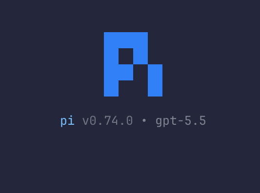

# Personal Pi Config



This is my personal [Pi](https://pi.dev) configuration. It contains my agent preferences, settings, themes, extensions, and other local setup bits.

## Installation

If you for some strange reason want it:

```sh
git clone <this-repo-url> ~/.pi/agent
cd ~/.pi/agent
pnpm install
```

Then start Pi as you normally would.
